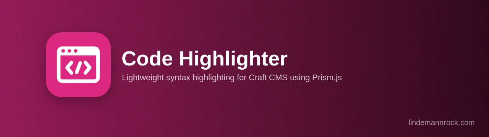

# Code Highlighter for Craft CMS

[](https://packagist.org/packages/lindemannrock/craft-code-highlighter)
[](https://craftcms.com/)
[](https://php.net/)
[](LICENSE)

Professional syntax highlighting for Craft CMS using Prism.js. Perfect for documentation sites, technical blogs, and any site displaying code.

## License

This is a commercial plugin licensed under the [Craft License](https://craftcms.github.io/license/). It will be available on the [Craft Plugin Store](https://plugins.craftcms.com) soon. See [LICENSE.md](LICENSE.md) for details.

## ⚠️ Pre-Release

This plugin is in active development and not yet available on the Craft Plugin Store. Features and APIs may change before the initial public release.

## Features

- **Code field with a real editor** — live syntax highlighting in the Control Panel, with line numbers, tab/indent handling, undo/redo, and an optional in-editor language switcher
- **~177 languages** — Prism's full language set, bundled and loaded on demand (with dependency resolution); choose which appear in field dropdowns
- **25 themes** — from classic Prism themes to Dracula, Nord, One Dark, VS Code Dark+ and more; set one plugin-wide or override it per page
- **Highlighting extras** — line numbers, copy-to-clipboard button, matching-brace highlighting, and inline CSS colour swatches
- **Twig API** — print a Code field, re-render with overrides, or highlight any string with the `|highlight` / `|prism` filters
- **Integration trait** — let other plugins highlight code with graceful fallback when this plugin isn't installed
- **Bundled & offline** — Prism core, all languages, and all themes are served from the plugin's own assets (no CDN)
- **CSS-variable theming** — restyle the wrapper and copy button without overriding selectors
- **12 languages** — Control-Panel UI translated out of the box

## Requirements

- Craft CMS 5.0 or greater
- PHP 8.2 or greater

## Installation

### Via Composer

```bash
composer require lindemannrock/craft-code-highlighter
```

```bash
php craft plugin/install code-highlighter
```

### Using DDEV

```bash
ddev composer require lindemannrock/craft-code-highlighter
```

```bash
ddev craft plugin/install code-highlighter
```

## Documentation

Full documentation is available in the [docs](docs/) folder.

## Support

- **Issues**: [GitHub Issues](https://github.com/LindemannRock/craft-code-highlighter/issues)
- **Email**: [support@lindemannrock.com](mailto:support@lindemannrock.com)

## Credits

- Uses [Prism.js](https://prismjs.com/) for syntax highlighting (MIT License)
- Uses [bililiteRange](https://github.com/dwachss/bililiteRange) for contenteditable handling (MIT License)

## License

This plugin is licensed under the [Craft License](https://craftcms.github.io/license/). See [LICENSE.md](LICENSE.md) for details.

---

Developed by [LindemannRock](https://lindemannrock.com)
